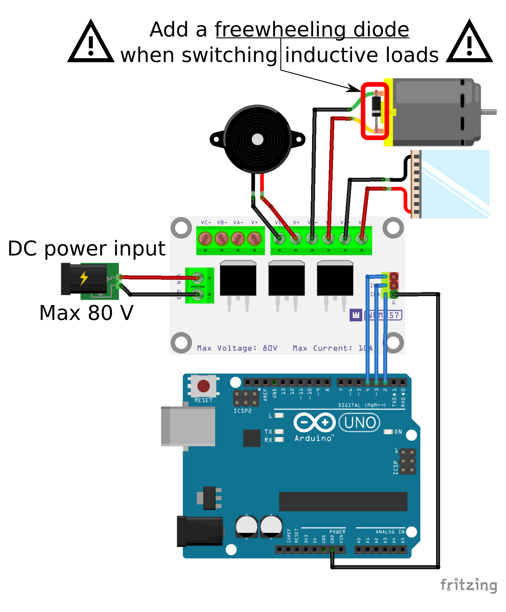

# Whadda 3-channel high power MOSFET module

This example shows how you can use the Whadda 3-channel high power MOSFET module
 (WPM357) with an Arduino® compatible board to control high-power DC loads.

## Library dependencies
* None

## Wiring diagram

## Additional information
  For more information about the Whadda Electronic scale load cell sensor (WPSE471), check the manual available at [whadda.com](https://whadda.com)

